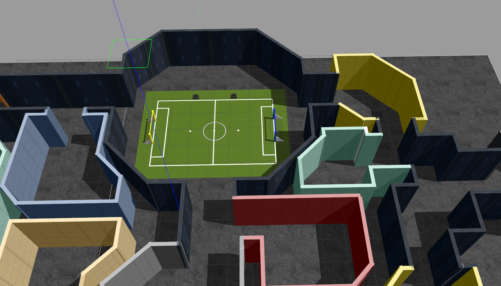

# RobotechVirtualChallenge

## Launching the Robotech virtual challenge world

### Clone the repo in your workspace and build it.
```console
git clone --recursive [-b noetic] https://github.com/RoboTech-URJC/RobotechVirtualChallenge.git
```


### Configuring your system
```console
  source ~/[robotech_ws]/devel/setup.bash
  export GAZEBO_MODEL_PATH=$GAZEBO_MODEL_PATH:[robotech_ws]/src/RobotechVirtualChallenge/robots/worlds/models
```
### Launching Gazebo
```console
  roslaunch robots sim_gui.launch
```

* **NOTE:** Set environment variable *TURTLEBOT3_MODEL*. For ejample: ``export TURTLEBOT3_MODEL=burger``. Doesn't matter what type of tb3
you set becasue this value is overwriten from launcher file.

Gazebo opens with a preliminary maze and a Turtlebot3 robot ready to test the maze.




### Navigate manually and try the arena
```console
  roslaunch roslaunch turtlebot3_teleop turtlebot3_teleop_key.launch
```

> Change cmd_vel topic by ns/cmd_vel in each case

### Launch rviz to take things under control
```console
  rosrun rviz rviz
```

## Pending tasks

- [ ] Complete and test the maze.
- [ ] Create a robot model with a pink/green/blue cilinder in top.
- [ ] Create the fight zone.
- [ ] Create the hide-and-seek game zone.
- [*] Launch and teleop 2 robots with different namespaces.
