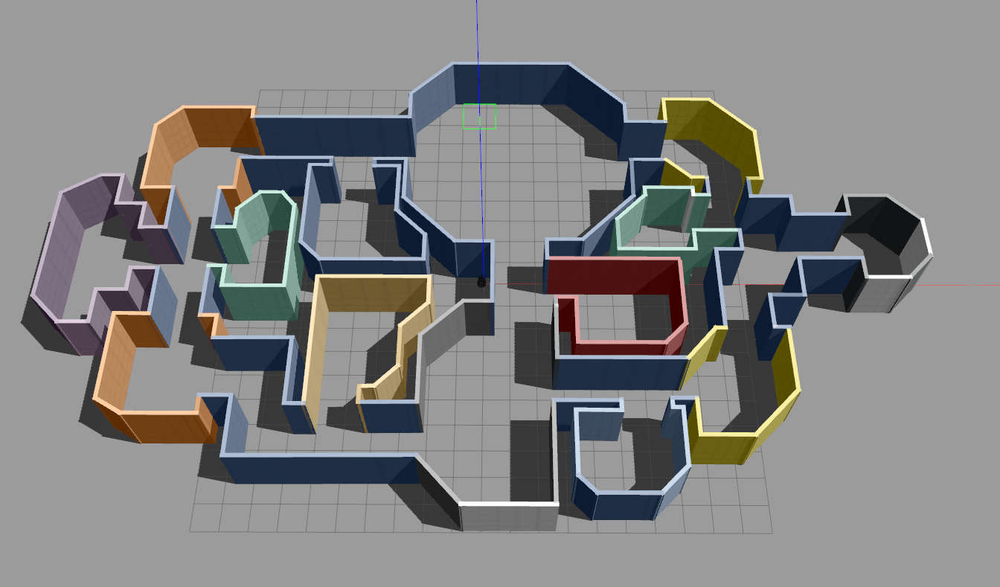

# RobotechVirtualChallenge

## Launching the Robotech virtual challenge world

### Clone the repo in your workspace and build it.
```console
git clone https://github.com/RoboTech-URJC/RobotechVirtualChallenge.git
```


### Configuring your system
```console
  source ~/[robotech_ws]/devel/setup.bash
  export GAZEBO_MODEL_PATH=$GAZEBO_MODEL_PATH:[robotech_ws]/src/RobotechVirtualChallenge/robots/worlds/models
```
### Launching Gazebo
```console
  roslaunch robots sim_gui.launch
```

Gazebo opens with a preliminary maze and a kobuki robot ready to test the maze.



### Navigate manually and try the arena
```console
  roslaunch kobuki_keyop keyop.launch
```

### Launch rviz to take things under control
```console
  rosrun rviz rviz
```

## Pending tasks

- [ ] Complete and test the maze.
- [ ] Create a robot model with a pink/green/blue cilinder in top.
- [ ] Create the fight zone.
- [ ] Create the hide-and-seek game zone.
- [ ] Launch and teleop 2 robots with different namespaces.
