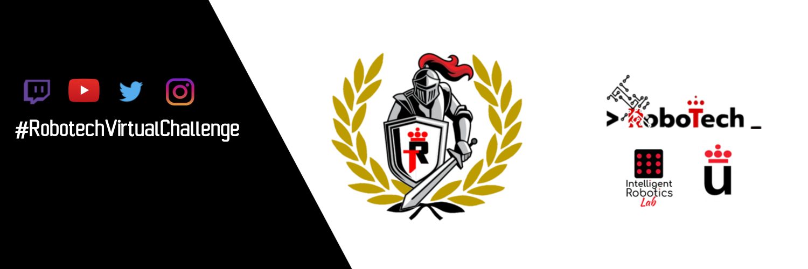
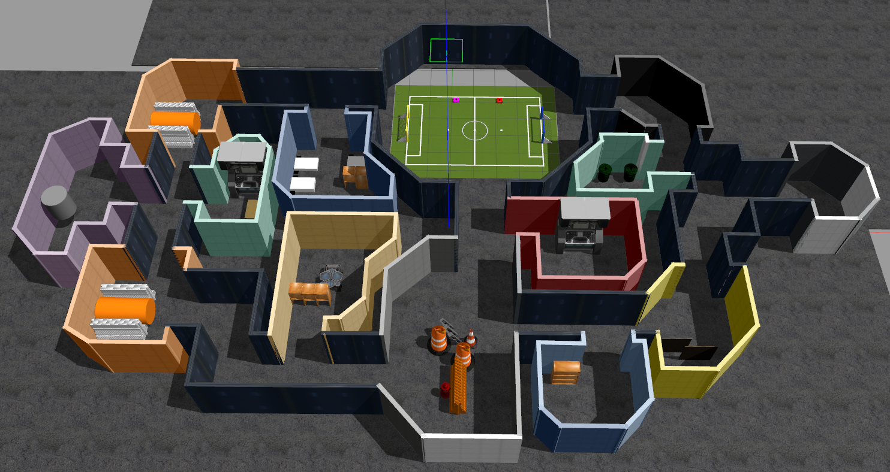

# RobotechVirtualChallenge


[](https://opensource.org/licenses/Apache-2.0)


## Launching the Robotech virtual challenge world

### Clone the repo in your workspace and build it.
```console
git clone --recursive [-b noetic] https://github.com/RoboTech-URJC/RobotechVirtualChallenge.git
```


### Configuring your system
```console
  source ~/[robotech_ws]/devel/setup.bash
  export GAZEBO_MODEL_PATH=$GAZEBO_MODEL_PATH:[robotech_ws]/src/RobotechVirtualChallenge/robots/worlds/models
  export TURTLEBOT3_MODEL=waffle
  rosdep check --from-paths ~/[robotech_ws]/src/RobotechVirtualChallenge -i
```
### Launching Gazebo
```console
  roslaunch robots sim_gui.launch
```

<!--* **NOTE:** Set environment variable *TURTLEBOT3_MODEL*. For ejample: ``export TURTLEBOT3_MODEL=burger``. Doesn't matter what type of tb3
you set becasue this value is overwriten from launcher file.-->

Gazebo opens with a preliminary maze and 2 Turtlebot3 robots ready to test the maze.




### Navigate manually and try the arena
```console
  roslaunch turtlebot3_teleop turtlebot3_teleop_key.launch
```
> Change cmd_vel topic by ns/cmd_vel in each case


### Using the navigation-stack
> purple robot
```console
  roslaunch navigation purple_tb3_navigation.launch
```
> red robot
```console
  roslaunch navigation red_tb3_navigation.launch
```
> The rviz is launched to take things under control.

### WebInterface -- [Tutorials](http://wiki.ros.org/roslibjs/Tutorials)
```console
  roslaunch rosbridge_server rosbridge_websocket.launch
  firefox  ~/[robotech_ws]/src/RobotechVirtualChallenge/web_interface/example/example.html
```
> Do a rostopic echo /robotech_vc_hub/football/event and click the buttons. It works!

> Move the robot with the teleop or the navigation-stack and check the interface.

## Pending tasks

- [ ] Complete and test the maze.
- [x] Create a robot model with different colours.
- [x] Create the fight zone.
- [x] Create the hide-and-seek game zone.
- [x] Launch and teleop 2 robots with different namespaces.
- [x] Launch and navigate with 2 robots with different namespaces.
